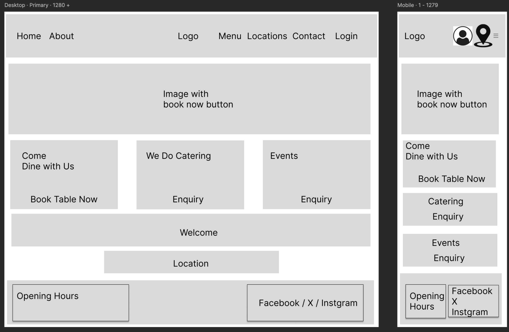
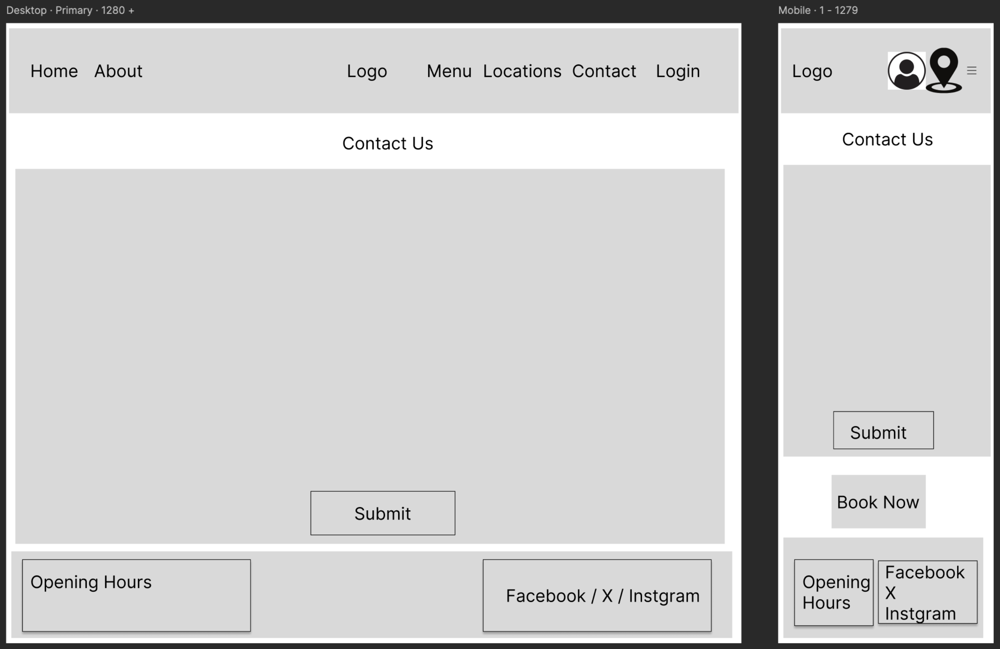
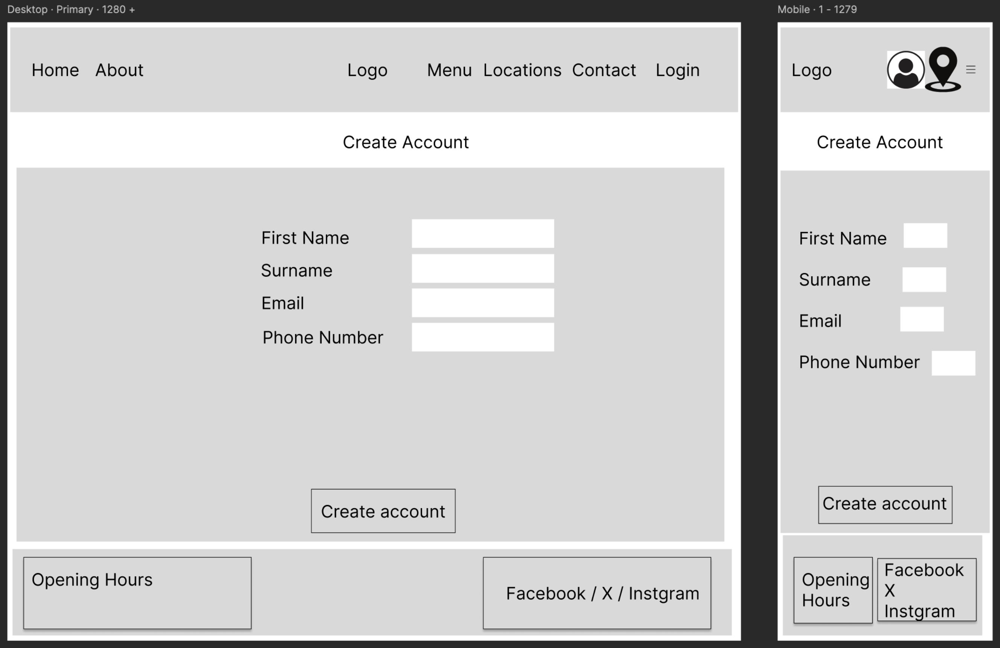
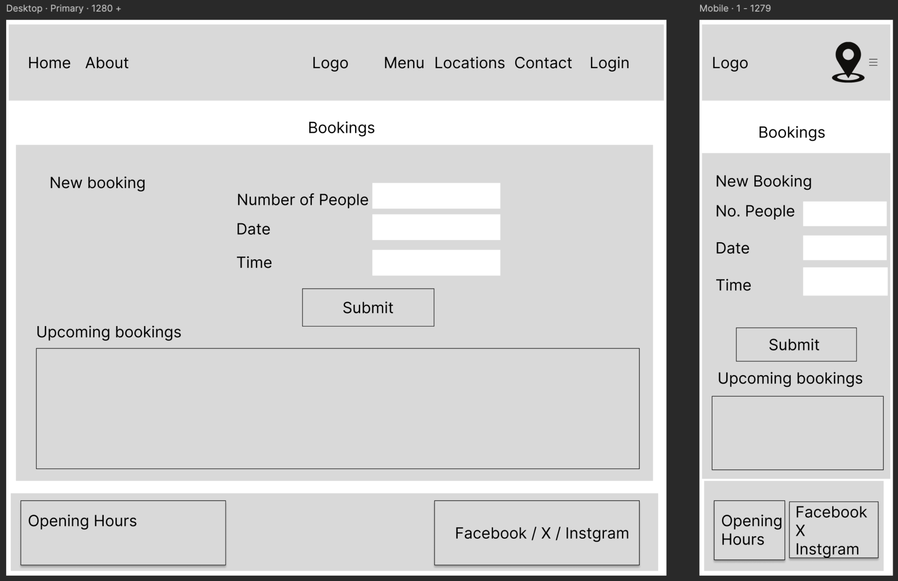
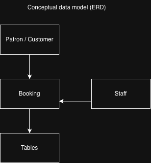
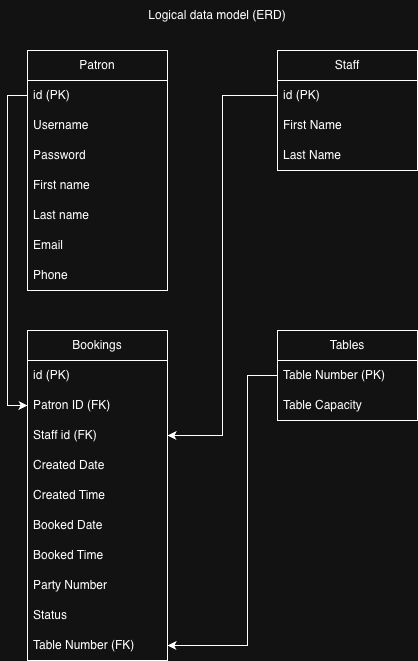
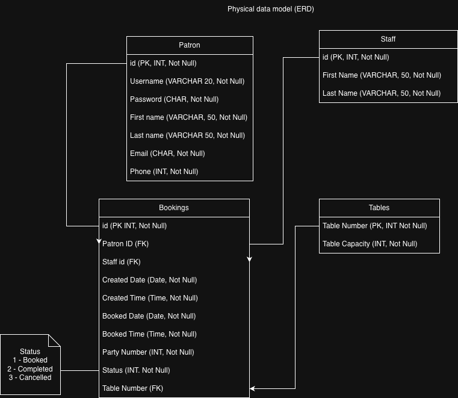

# the-marina-pizzeria

## Table of Contents:

1. [About](#about)
2. [Business Goals](#business-goals)
3. [User Stories](#user-stories)
4. [Wireframes](#wireframes)
5. [Entity Relationship Diagrams](#entity-relationship-diagrams)
5. [Design and How to use the website](#design-and-how-to-use-the-website)
6. [Languages and Technologies used](#languages-and-technologies-used)
7. [Links Used](#links-used)
8. [Media Used](#media-used)
9. [Results from testing](#results-from-testing)
10. [Fixed](#fixed)
11. [Testing and Results from final testing](#testing-and-results-from-final-testing)
12. [Final Product](#final-product)
13. [Business Goals and User Stories met](#business-goals-and-user-stories-met)
14. [Deployment](#deployment)
15. [References](#references)
16. [Issues](#issues)
17. [Limitations](#limitations)
18. [Acknowlegements](#acknowlegements)
19. [Thank You](#thank-you-for-reviewing-this-product)

## About: 
### The Marina Pizzeria is a fictional restaurant. This fictional pizzeria was created for academic purposes to illustrate the uses of HTML, CSS, JavaScript, Python, Bootstrap and Django languages and frameworks. The Key elements in The Marina Pizzeria are:
 - About Us: A fictional tale about the family history and scenery as well as the cuisines available at the restaurant as well as the options available to users on the website. 
 - Home: takes person to the home page of the website. 
 - Book Now: for dining in.  This restuarant boasts on having an Italian type pizza menu including starters, mains, sides and desserts. 
 - Register : new customers can create an account. 
 - Log In: allows a patron to log into their account and book a table for dining. 
 - Contact Us:  allows patrons to ask for catering services, to host a event or to lodge a complaint by submitting a form. 
 - Social links in the Footer: Patrons can join The Marina Pizzeria on the social media via facebook, X (formerly called twitter) and instagram (clicking on these social links will only take the user to the main home poage of these social media sites as there is no Marina Pizzeria).
 - Menu: takes the patron to see all the available food options which includes: Starters, Mains, Sides, Desserts and Drinks. 
 - Location finder: This is located on the Main Home in the lower page in the larger screen displays and in the Navigation Bar in the mobile devices.

 ## Business Goals

1. To allow patrons to make bookings at The Marina Pizzeria.
2. To make available to the public the various cuisines that the establishment produces.
3. To give the public a method to contact the establishment.
4. To allow patrons to find The Marina Pizzeria through the website. 
5. Increase online awareness of The Marina Pizzeria through Search Engine Optimizarion.
6. To allow the public to know about the history and operations of The Marina Pizzeria.
7. To allow patrons to be able to edit or delete their bookings at The Marina Pizzeria. 
8. To allow patrons the ability to delete or edit their account information. 

## User Stories:

Although The Marina Pizzeria is a fictitious restaurant, to demonstrate a website, possible user stories could include:

1. As a user, I can see the menu options and prices so that I can decide if I would like to dine there.
2. As a user, I can book online so that I don't have to call the staff to book my table for me.
3. As a user, I can change the date, time or cancel my booking so that I don't have to call the staff at the pizzeria if my plans change.
4. As a user, I can add dietary restrictions so that the staff can properly prepare for my visit.
5. As a user, I can receive email confirmation of my bookiing so that I can have a record of my booking.
6. As a restaurant manager, I can seset a fixed number of tables so that there is no overbooking.
7. As a manager, I can ensure the correct number of seated tables are listed so that efficiency is maximized (e.g. a single person does not book a table for 6).
8. As a manager, I can be know of any dietary restrictions of any patron so that the staff is well informed.
9. As a manager, I can see all bookings for all tables at the establishment so that the staff can make amendments, or cancel bookings on behalf of the patrons.
10. As a user, I can cancel my account so that I can have no personal information at the establishment should I move locations or decide I no longer want to dine there.

## Wireframes:

1. Home Page for mobiles, tablets, laptops and PC:
   

2. Menu Page for mobiles, tablets, laptops and PC:
   

3. Log In Page for mobiles, tablets, laptops and PC:
   

4. Contact Us page for mobiles, tablets, laptops and PC:
   

5. Register page for mobiles, tablets, laptops and PC:
   

6. Bookings Page for mobiles, tablets, laptops and PC:
   

## Entity Relationship Diagrams:

1. Conceptual Data Model (ERD):

    

2. Logical Data Model (ERD):

    

3. Physical Data Model (ERD):

        

## Languages and Technologies used:

1. HTML
2. CSS
3. JavaScript
4. Python 
5. Django framework 
6. Bootstrap version 5.3.8 Library - for navigation bar, footer and other body elements and class implementation for styling .
7. Font Awesome library for icons
8. Google Fonts to import additional fonts
9. Artificial Intelligence Technologies (Gemini) was used to create The Marina Pizzeria Logo as well as the favicons of various sizes.
10. Chrome developer tools, Inspector, to get screenshots of the product webpage on varioussized devices.
11. Nu HTML Validator to check the HTML code.
12. W3C CSS Validator to check the CSS code.
13. Accessibility Checker from accessibilitychecker.org to check the accessibility using WCAG 2.1 and WCAG 2.0 guidelines.
14. Figma software was used to create the wireframes.
15. dbdiagrams.io for Entity Relationship Diagrams (ERD).

## Links used:

- External links include the social media links below:

1. Facebook:
   [Facebook](https://www.facebook.com)

2. Instagram:
   [Instagram](https://www.instagram.com)

3. X (formerly known as Twitter):
   [X](https://www.twitter.com)

## Design and How to Use the Website:

- This product (The Marina Pizzeria website) was designed to serve both the business goals and user stories. The purpose of this product was to be a means to increase awareness of The Marina Pizzeria and to detail services that this restaurant offer (About Us, Contact Us, Menu options, Bookings, LogIn, Register etc). Certain details have been left out due to time constraints and is mentioned under issues.

- The Marina Pizzeria has a clear and simple design made easy for users to navigate by using the same design format for all the pages.
    - Each page has a navigation bar on top where the links are shown and for smaller devices instead of the navigation links there is a dropdown burger menu. Also there is a logo on the top right that leads to the home page.On mobile devices the location finder was placed on the top right side for easy finding. 
    - Each page has a footer section with the logo on the bottom left, the middle has a table with the opening hours and the bottom right has links to the social media links and a contact us section
    - Both the navigation bar and the footer are the same color on all screen sizes and on all pages.
    - the product was designed to be responsive to all screen devices so that words on paragraphs or forms do not overflow the borders or tables.
    - In ALL pages there are links to the Home page and clicking on the logo (which is in all pages) will return the user to the home page.
    - The between section of the navigation bar on top and the footer below vary with each page. However the background color is the same and matches with the top and bottom color to give continuity.

    ## Reference: 
    1. https://www.geeksforgeeks.org/python/django-sign-up-and-login-with-confirmation-email-python/ (django code information for login, logout, registration form and email)